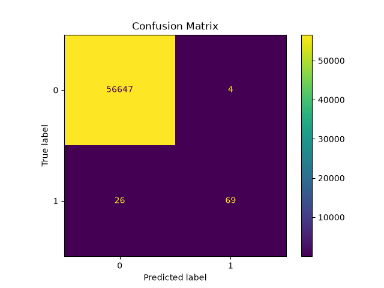
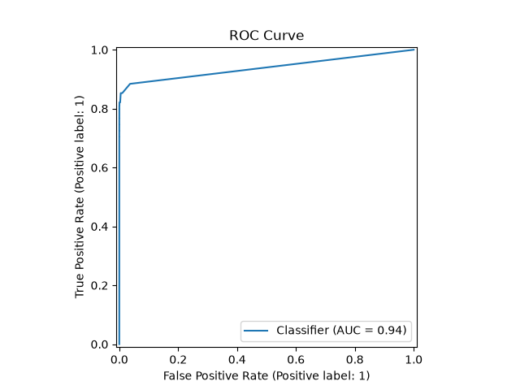
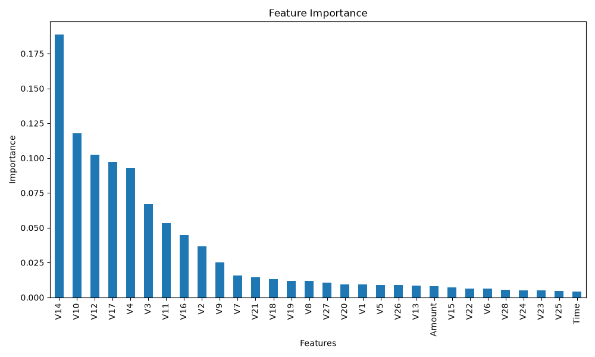

# Credit Card Fraud Detection using Random Forest

## Overview

This project implements a machine learning model to identify fraudulent credit card transactions using a **Random Forest Classifier**. The objective is to accurately distinguish between legitimate and fraudulent transactions while minimizing false positives and false negatives.

The project demonstrates a complete machine learning workflow, including data preprocessing, model training, evaluation, and visualization of results using industry-standard performance metrics.

---

## Features

* Data preprocessing and preparation
* Random Forest Classification
* Model evaluation using multiple metrics
* Confusion Matrix visualization
* ROC Curve analysis
* Feature Importance visualization
* Clean and well-documented Python implementation

---

## Technologies Used

* Python
* Pandas
* Matplotlib
* Seaborn
* Scikit-learn

---

## Project Structure

```text
Credit-Card-Fraud-Detection/
│
├── images/
│   ├── CM_CCfraud.png
│   ├── ROC_CCfraud.png
│   └── Feature_Imp_CCfraud.png
│
├── a_CreditCard_Fraud.py
├── Requirements.txt
├── README.md
├── LICENSE
└── .gitignore
```

---

## Dataset

The dataset used in this project is publicly available.

**Download Dataset Here:**

> **[Paste your dataset link here]**

After downloading the dataset, place it in the project directory before running the program.

---

## Installation

Clone the repository:

```bash
git clone https://github.com/your-username/your-repository.git
```

Move into the project directory:

```bash
cd your-repository
```

Install the required libraries:

```bash
pip install -r Requirements.txt
```

Run the project:

```bash
python a_CreditCard_Fraud.py
```

---

## Model Evaluation

The model is evaluated using several classification metrics:

* Accuracy
* Precision
* Recall
* F1-Score
* ROC-AUC Score
* Classification Report
* Confusion Matrix
* ROC Curve

These metrics provide a comprehensive understanding of the model's ability to detect fraudulent transactions.

---

# Results

## Confusion Matrix

<p align="center">
  
</p>

---

## ROC Curve

<p align="center">
  
</p>

---

## Feature Importance

<p align="center">
  
</p>

---

## Project Workflow

1. Load the credit card transaction dataset
2. Explore and preprocess the data
3. Split the dataset into training and testing sets
4. Train a Random Forest Classifier
5. Generate predictions
6. Evaluate model performance
7. Visualize the results

---

## Future Improvements

* Hyperparameter tuning using GridSearchCV
* Comparison with additional machine learning models
* Cross-validation for improved reliability
* Model deployment using Flask or FastAPI
* Interactive web interface for real-time prediction

---

## Learning Outcomes

This project strengthened my understanding of:

* Data preprocessing
* Handling imbalanced classification problems
* Ensemble learning with Random Forest
* Performance evaluation for classification models
* Model visualization and interpretation
* Building complete machine learning pipelines using Scikit-learn

---

## License

This project is released under the MIT License.

---

## Author

Developed as part of my Machine Learning learning journey using Python and Scikit-learn.
